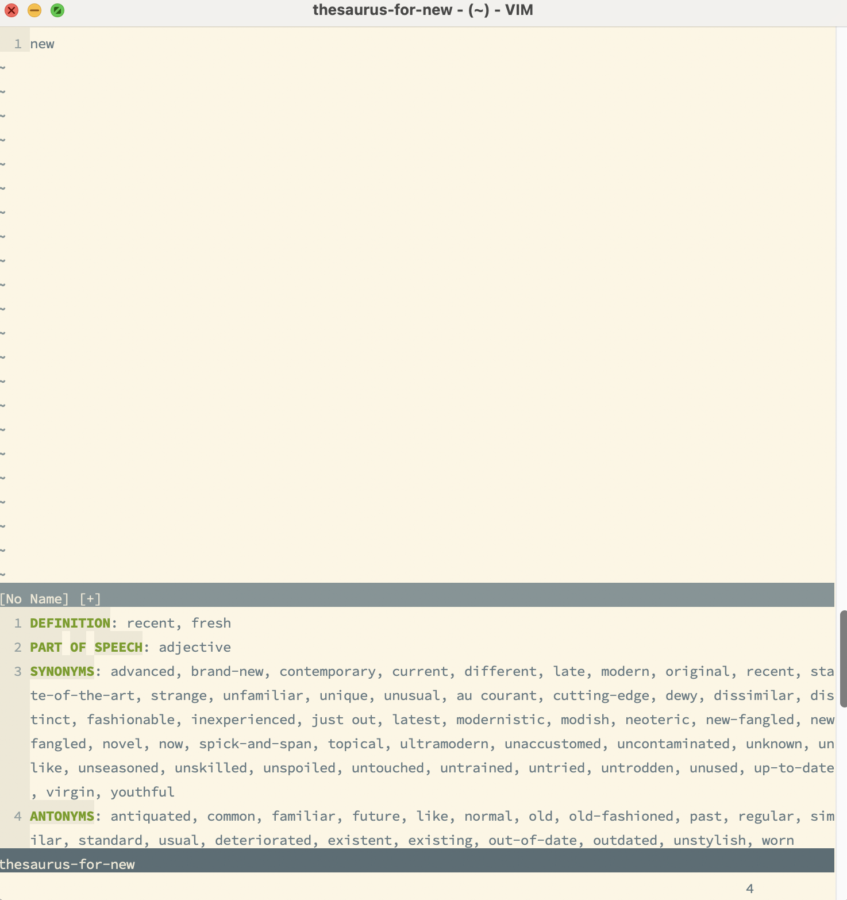

# Online-thesaurus-vimplug
This is a vim plugin that retrieves the synonyms and antonyms of a given word from the website at www.thesaurus.com. 

The credit for the original ideas go to Anton Beloglazov <http://beloglazov.info/> and Nick Coleman <http://www.nickcoleman.org/>. 


This plugin is implemented partially because the original plugin by Anton at
https://github.com/beloglazov/vim-online-thesaurus
seems to have stopped working as for 12/05/2018 on vim 8.0 on windows or Mac. The original implementation was through a bash script so a git bash installation is normally needed on windows. The current implementation eliminates this necessity by programming the core functionality in python. 

## Pre-requisites
1) Vim must have been compiled with python support (either python 2 or python 3 would work). 
2) A python 2 or python 3 distribution is installed and it working properly with Vim. The plugin relies only on standard libraries so there is no need to install extra packages in your python distribution.

To check you have both conditions satisfied, simply fire your vim and do

```:py print(“hello”)``` 
or
```:py3 print(“hello”)```

If you can see the output "hello" in the message area you are good to go. If not, see the FAQ at the bottom.

## Installation 
For vim version > 8.0 you can  install the plugin by
```
cd ~/.vim/pack/plugins/start/
git clone https://github.com/Ben201310/online-thesaurus-vimplug
```
NOTE: on windows this should be ```cd ~/vimfiles/pack/plugins/start/```

For vim version < 8.0 you can use Vundle or Pathogen. Take Pathogen as an example, you can
```
cd ~/.vim/bundle/
git clone https://github.com/Ben201310/online-thesaurus-vimplug
```

## Usage
Usage is simple. 

1) Put your cursor on the word whose antonyms and synonyms you would like to know, then press 
```
<Leader>t
 ```
 A preview windows will open at the bottom of the current window with retrieved content. You can close the window by pressing ```q```


2) If you want to look for a word ‘quick’ for example. You can run 
```
:call Thesaurus_LookWord(‘quick’)
```

## Customization
If you prefer a different key map for looking up the word under your cursor, put the following in the .vimrc file
```
let g:use_default_key_map = 0
nnoremap YOUR_OWN_KEY :call Thesaurus_LookCurrentWord()<CR>
```
  
## FAQ
1. If your python support test does not go through, 
    1. type
    ```:version``` 
    look for something like ```+python``` or ```+python3``` in the output. If you could not find them, you may need to reinstall your vim using a version with python support. 

    2. If you found the ```+python``` or ```+python3``` entries, you vim instalation should be fine. The problem could either be due to 
        1. your do not have a python distribution installed, or it is not stored in the $PATH enviroment variable. 
        2. You have installed a 64-bit python distribution while your vim is a 32-bit installation, or vice versa. In this case, reinstalling python to match vim's architeture should work.


